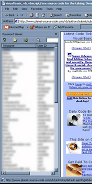



## PwdViewer & IE Bar

### Description

PasswordViewer is VB application that organizes all of your passwords. Passwords are stored encrypted in Access database. The app provides regular windows interface as well as IE explorer bands. Explorer band can insert the password right into <INPUT> tag of the page.
 
### More Info
 

             |
---                |---
**Submitted On**   |2001-07-16 20:59:28
**By**             |[Sergey Kats](https://github.com/Planet-Source-Code/PSCIndex/blob/master/ByAuthor/sergey-kats.md)
**Level**          |Advanced
**User Rating**    |5.0 (20 globes from 4 users)
**Compatibility**  |VB 6\.0
**Category**       |[Complete Applications](https://github.com/Planet-Source-Code/PSCIndex/blob/master/ByCategory/complete-applications__1-27.md)
**World**          |[Visual Basic](https://github.com/Planet-Source-Code/PSCIndex/blob/master/ByWorld/visual-basic.md)
**Archive File**   |[PwdViewer 229217162001\.zip](https://github.com/Planet-Source-Code/sergey-kats-pwdviewer-ie-bar__1-25110/archive/master.zip)

